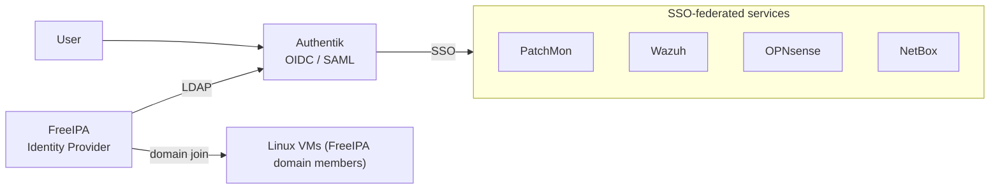
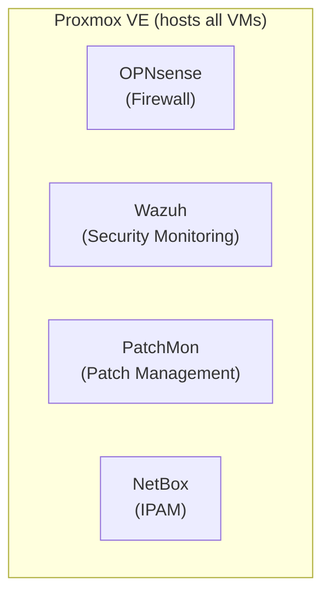

# Architecture

## Overview

This infrastructure is a centralized, secure, virtualized environment built on **Proxmox VE**, with **OPNsense** providing network security and segmentation, **FreeIPA** as the authoritative identity store, **Authentik** providing SSO/federation on top of FreeIPA, **Wazuh** providing security monitoring/SIEM, and **PatchMon** providing centralized patch management.

## Identity & Authentication Architecture

FreeIPA is the primary source of identities, users, groups, and authentication. Linux VMs are joined to the FreeIPA domain for centralized account and access management.

Authentik integrates with FreeIPA and acts as an authentication/federation layer for applications that can't speak LDAP directly, or that need modern protocols (OIDC/OAuth2, SAML).

```
User → Authentik → FreeIPA
```

This lets services like PatchMon, Wazuh, and OPNsense use centralized authentication while FreeIPA remains the single source of truth for identity.

**NetBox** supports OIDC/SAML (via `python-social-auth`) in addition to direct LDAP, so it authenticates through **Authentik** just like PatchMon, Wazuh, and OPNsense — no direct-to-FreeIPA exception needed.



## Infrastructure Layers



## Network Segmentation


| Segment | Purpose | VLAN | Subnet |
|---|---|---|---|
| Management | Proxmox, OPNsense | 5 | 10.0.5.0/24 |
| Infrastructure | PatchMon, Wazuh, FreeIPA, Authentik | 10 | 10.0.10.0/24 |
| Compute | Other VMs | 15 | 10.0.15.0/24 |

## Component Responsibilities

- **Proxmox VE** — hosts and manages all VMs
- **OPNsense** — firewall, routing, inter-segment traffic control
- **FreeIPA** — identity, groups, DNS, Kerberos, domain join for Linux VMs
- **Authentik** — SSO/federation for apps needing OIDC/SAML instead of raw LDAP
- **Wazuh** — log collection, correlation, alerting, SIEM
- **PatchMon** — OS patch visibility and management across all hosts
- **NetBox** — IPv4/IPv6 prefix and subnet tracking, VRF/VLAN allocation; planned expansion into DCIM and broader network source-of-truth

